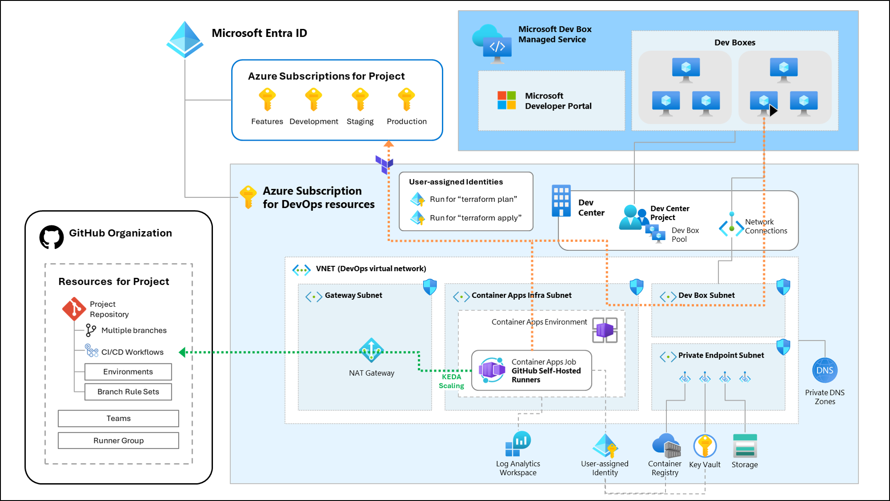

# Azure プロジェクトの CI/CD デプロイのための DevOps ランディングゾーン

[English](./README.md) | [日本語](./README.ja.md)

---

## 概要

このリポジトリは、Terraform と CI/CD ワークフローを使用して Azure リソースをデプロイおよび管理するための、包括的なモジュール型の Infrastructure as Code ソリューションを提供します。Azure DevOps と GitHub ベースの CI/CD ワークフローの両方をサポートするように設計されており、組織は Git でバージョン管理された Infrastructure as Code を使用して、安全でスケーラブル、かつポリシーに準拠したクラウド環境のプロビジョニングを自動化できます。このモジュールによって提供されるプロジェクト Git リポジトリは、エンタープライズ環境で使用するように設計されており、Azure および Terraform のベスト プラクティスに準拠しています。

主な機能は次のとおりです。

- **モジュール型の Terraform アーキテクチャ**： 一般的な Azure および DevOps パターン用の再利用可能なモジュール
- **Azure DevOps と GitHub のサポート**： プロジェクト、リポジトリ、パイプライン、および、セルフホステッドエージェント/ランナーのプロビジョニング
- **セキュアな状態とシークレットの管理**： Azure Storage と Key Vault を使用して、Terraform の状態と機密情報を管理します
- **エンタープライズ対応**： デプロイメントタスク実行におけるセキュアなクローズドネットワーク、ID、リポジトリポリシー適用のためのベストプラクティスを実装しています
- **拡張性とカスタマイズ性**： さまざまな組織の要件やクラウドガバナンスモデルに容易に適応できます

`infra/terraform` ディレクトリには、すべてのコアインフラストラクチャコードが含まれており、明瞭性と拡張性を考慮して整理されています。チームは基盤となるリソースのブートストラップ、DevOps ランディングゾーンのデプロイ、プロジェクト固有の DevOps リソースの一貫した自動化された管理が可能となります。

> [!NOTE]
> 現時点では GitHub プロジェクトのみをサポートしています。
>
> 将来的に Azure DevOps プロジェクトをサポートする予定です。

## Azure リファレンス アーキテクチャ

Azure ネットワークを含めたアーキテクチャは、以下の図の通りです。この図では、プライベート仮想ネットワークを有効にし、GitHub セルフホステッド ランナーを Azure Container App のジョブを使って、KEDA スケーリングを使ってイベント駆動型で CI/CD ワークフローのジョブを実行する構成を示しています。

また、開発者がセキュアな開発環境を使って Azure プロジェクトの開発を行うことができるよう、Microsoft Dev Box のためのプロジェクトが展開される構成を示しています。Dev Box の仮想テスクトップはプライベート仮想ネットワークに接続されるため、セキュアに Terraform 状態管理ファイルにアクセスを行い、Azure リソースの展開と管理を行うことができます。

## はじめる

このプロジェクトを開始するには、「[はじめる](./docs/Get-Started.ja.md)」ドキュメントに記載されている手順に従って始めてください。

## 謝辞

このプロジェクトは [Azure Landing Zone Accelerator](https://github.com/Azure/alz-terraform-accelerator) プロジェクトから着想を得ています。[Azure Landing Zone Accelerator](https://github.com/Azure/alz-terraform-accelerator) プロジェクトはエンタープライズ向けの Azure Landing Zone プラットフォーム基盤の CI/CD デプロイメントに焦点を当てていますが、このプロジェクトは一般的な Azure プロジェクトの CI/CD デプロイメントに焦点を当て、アーキテクチャとモジュールを汎用化しました。[Jared Holgate](https://github.com/jaredfholgate) 氏、および、プロジェクトの貢献者およびチーム メンバーの皆様に感謝申し上げます。

## コントリビューション

このプロジェクトでは、コントリビューションやご提案を歓迎しています。ほとんどのコントリビューションには、コントリビューション ライセンス契約への同意 (CLA) が必要です。この契約では、貢献者が貢献内容を使用する権利を有し、実際にその権利を当社に付与することを宣言しています。詳細については、[コントリビューション ライセンス契約](https://cla.opensource.microsoft.com) をご覧ください。

プルリクエストを送信すると、CLA ボットが自動的に CLA 同意の提供が必要かどうかを判断し、PR を適切に処理します (例: ステータスチェック、コメント作成などを行います)。CLA ボットの指示にそのまま従ってください。この同意のための操作は、CLA を使用しているすべてのリポジトリで 1 度だけ実行するだけで構いません。

このプロジェクトは、[Microsoft オープンソース行動規範](https://opensource.microsoft.com/codeofconduct/) を採用しています。
詳細については、[行動規範に関する FAQ](https://opensource.microsoft.com/codeofconduct/faq/) をご覧ください。
ご質問やご意見がございましたら、[opencode@microsoft.com](mailto:opencode@microsoft.com) までお問い合わせください。

## 商標

本プロジェクトには、プロジェクト、製品、またはサービスの商標またはロゴが含まれている場合があります。Microsoft の商標またはロゴの使用は、
[Microsoft の商標およびブランド ガイドライン](https://www.microsoft.com/legal/intellectualproperty/trademarks/usage/general) の対象となり、これに従う必要があります。
本プロジェクトの改変版における Microsoft の商標またはロゴを使用する場合には、混乱を招いたり、Microsoft のスポンサーシップを暗示したりしてはいけません。
サードパーティの商標またはロゴの使用は、当該サードパーティのポリシーに従うものとします。
