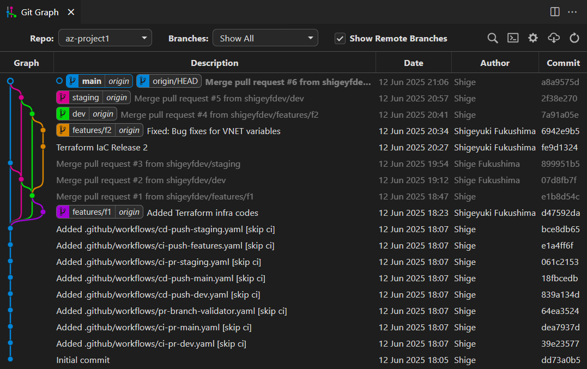

# CI/CD ワークフローとアーキテクチャの概要

[English](./GitHub-Actions-Workflow-Architecture.md) | [日本語](./GitHub-Actions-Workflow-Architecture.ja.md)

このドキュメントで紹介する CI/CD ワークフロー アーキテクチャは、GitHub Actions、Terraform を用いた IaC、および、Azure のベスト プラクティスを活用することで、安全性が高く、自動化され、かつ、監査可能な Azure リソースのプロビジョニングを実現します。

本プロジェクトのリポジトリでは、このアーキテクチャを構成する DevOps プロジェクト環境を提供します。

## ワークフローのアーキテクチャ概要

以下の図は、GitHub Actions と Terraform を使用して、プロジェクトの Azure サブスクリプションに Azure リソースをプロビジョニングするための CI/CD ワークフローを示しています。

GitHub Actions の GitHub Runner（CI/CD パイプラインの実行エージェント）は、GitHub ホステッド環境、または、お客様の Azure 環境上に構築されたセルフホステッドランナーのいずれかで動作します。
お客様の Azure 環境上に構築されたセルフホステッドランナーに関しては、本プロジェクトでは Azure サブスクリプション内の DevOps ランディング ゾーンで提供するコンテナ環境 (Azure Container Apps や Azure Container Instances) によって管理されます。

> 図 1: GitHub Actions ワークフローアーキテクチャの概要。Terraform を用いた Azure リソースデプロイの流れを示す。

### ワークフローのコンポーネント

本プロジェクトのリポジトリでは、CI/CD ワークフローの構成要素として、以下のコンポーネントがプロビジョニングされます。

- **リポジトリとブランチ**
  - リポジトリは、Azure リソースをコード (IaC = Infrastructure as Code) で管理するためのバージョン管理基盤です。
  - リポジトリには、以下のブランチを用意し、それぞれのの主な用途は以下の通りです：

    | ブランチ名   | 目的および役割                                                                                        |
    | ------------ | ----------------------------------------------------------------------------------------------------- |
    | `features/*` | 新機能や個別の変更を開発するためのフィーチャーブランチ。ローカルな開発および試験用。                  |
    | `dev`        | 統合開発環境（Development）向けのブランチ。複数の `features/*` ブランチを統合し、動作検証を行います。 |
    | `staging`    | 本番環境に近い構成のステージング環境用ブランチ。本番リリース前の最終検証を目的としています。          |
    | `main`       | 安定版コードが存在するブランチ。本番環境へのデプロイはこのブランチから行われます。                    |

- CI/CD ワークフロー (GitHub Actions を使用) は、各ブランチ (`features/*`、`dev`、`staging`、`main` ブランチ) へのプルリクエストと直接プッシュによってトリガーされます。

- GitHub Actions による **ワークフロー**
  - GitHub Actions は、各ブランチ (`features/*`、`dev`、`staging`、`main` ブランチ) におけるマージやプッシュに応じて、以下のように処理を段階的に実行します。詳細なワークフローについては、後述で説明します。
    - `features/*` → `dev`: PR (プルリクエスト) による `validate` + `plan`
    - `dev` プッシュ: マージコミットのプッシュによる `plan` + `apply` による自動デプロイ
    - `dev` → `staging`: PR (プルリクエスト) による `validate` + `plan`
    - `staging` プッシュ: マージコミットのプッシュによる `plan` + `apply` による自動デプロイ
    - `staging` → `main`: PR (プルリクエスト) による `validate` + `plan`
    - `main` プッシュ: マージコミットのプッシュによる `plan` + `apply` による自動デプロイ

  - **CI** ワークフロー
    - Terraform の `validate` および `plan` ジョブが PR (_プルリクエスト_) により実行され、Terraform IaC コードの構文や整合性の検証、および、リソース変更のプレビューが行われます。
    - このワークフローは、例えば、`features/*` から `dev`、`dev` から `staging`、`staging` から `main` のマージ前にトリガーされるよう設計されています。

  - **CI/CD** ワークフロー
    - Terraform の `plan` および `apply` ジョブがブランチへのプッシュにより実行され、Terraform IaC コードの変更内容を確認し、それに基づいて Azure リソースのプロビジョニングを行います。
    - このワークフローは、マージコミットがターゲットブランチ (`dev`、`staging`、`main` ブランチなど) に統合された後、Azure リソースを自動的にデプロイする継続的デリバリープロセスとして機能します。

- **ジョブと環境**
  - 各ジョブ (`validate`、`plan`、`apply`) は GitHub Runner 上で実行されます。GitHub Runner は、GitHub ホステッド、または、セルフホステッド (Azure 環境上など) で運用可能です。
  - 各環境は、GitHub Actions の環境 (_Environment_) として `env-<project>-main-plan` や `env-<project>-main-apply` といった形式で定義され、適切な環境変数により制御されます。
    - Azure リソースのプロビジョニング先となる Azure サブスクリプション ID
    - Azure サブスクリプション内の Azure リソースを操作する権限を持つユーザー割り当てマネージド ID
    - 環境変数の詳細は、以下を参照ください。

- **変数**
  - リポジトリスコープ変数
    - `AZURE_TENANT_ID`: Azure テナント ID
    - `BACKEND_AZURE_RESOURCE_GROUP_NAME`: Terraform AzureRM バックエンドストレージのリソースグループ名
    - `BACKEND_AZURE_STORAGE_ACCOUNT_CONTAINER_NAME`: Terraform AzureRM バックエンドストレージのコンテナ名
    - `BACKEND_AZURE_STORAGE_ACCOUNT_NAME`: Terraform AzureRM バックエンドストレージのストレージアカウント名

  - 環境スコープ変数
    - `AZURE_SUBSCRIPTION_ID`: Azure リソースのプロビジョニング先となる Azure サブスクリプション ID
    - `AZURE_CLIENT_ID`: Azure サブスクリプション内の Azure リソースを操作する権限を持つユーザー割り当てマネージド ID

- **Azure 統合**
  - コンテナプラットフォーム管理
    - GitHub セルフホストランナーとして実行されるコンテナ アプリケーションを提供します。
    - Azure Container App (Job) は、KEDA によるスケーリングに対応したイベント駆動型ジョブ実行プラットフォームです。
    - Azure Container Instance は、常時稼働型のランナープラットフォームを提供します

  - ID 管理
    - セキュリティとアクセス制御のベストプラクティスとして、`terraform plan` と `terraform apply` で異なるユーザー割り当てマネージド ID を使用します：
      - `plan` 用のマネージド ID: Azure サブスクリプションの `Reader` ロール
      - `apply` 用のマネージド ID: Azure サブスクリプションの `Contributor` ロール

- **プロジェクト用の Azure サブスクリプション**
  - Azure リソースをデプロイするためのプロジェクト用サブスクリプションが必要です。
  - プロジェクトのフェーズ (開発、開発統合、ステージング、本番) に応じて、あらかじめ複数の Azure サブスクリプションを用意しておくことが推奨されます。
  - 各環境に対し、ユーザー割り当て ID に適切なロール (`Contributor`、`Reader`) を割り当てます。

## 複数ブランチにまたがる CI/CD 戦略

以下の図は、GitHub Actions のワークフローアーキテクチャをベースに、Terraform の IaC を活用して Azure リソースを安全に管理・プロビジョニングするための堅牢な CI/CD 戦略を示しています。

このブランチ戦略と CI/CD パイプラインにより、以下が実現されます:

- 開発・ステージング・本番環境の**明確な分離**
- コード品質の**継続的検証**
- **制御された昇格 (プロモーション) プロセス**
- 構成ミスや不正な変更を防ぐための**セーフガードの実装**

> 図 2: CI/CD ワークフロー戦略

### CI/CD ワークフロー シナリオ

この戦略は、以下のステップを通じて、開発から本番環境への安全かつ管理された移行を保証します：

1. 開発者による**機能開発**
   - 開発者は、`features/F1` や `features/F2` のようなフィーチャーブランチを作成し、変更をプッシュします。
   - フィーチャーブランチに変更をプッシュする前に、開発者は手動でテストを行います。

1. **開発ブランチ (`dev`) へのプルリクエスト**
   - フィーチャーブランチから `dev` ブランチに向けて PR (_プルリクエスト_) を作成します。
   - CI により Terraform コードの構文チェックや Azure リソース変更内容の検証が自動実行されます。
   - レビューとテストが完了すれば `dev` ブランチにマージされます。

1. **開発環境へのプロビジョニング**
   - `dev` ブランチへのマージコミットにより CI/CD パイプラインがトリガーされ、Azure の**開発環境**へ Terraform IaC の変更内容が自動で適用されます。
   - 開発者はこの環境で動作検証を行います。

1. **ステージング環境への昇格**
   - `dev` ブランチから `staging` ブランチへの PR (_プルリクエスト_) を作成します。
   - CI による再検証の後、**手動承認**を経てマージされます。
   - `staging` ブランチへのマージコミットにより CI/CD パイプラインがトリガーされ、Azure の**ステージング環境**へTerraform IaC の変更内容が自動プロビジョニングされます。
   - **ステージング環境**へのプロビジョニング前には、プロビジョニングの手動承認を行います。

1. **ステージングでの検証**
   - ステージング環境でテストを行い、本番リリースに向けた最終確認をします。
   - 問題があれば `dev` ブランチで修正し、再昇格します。

1. **本番環境への昇格**
   - `staging` ブランチから `main` (本番) ブランチへの PR (_プルリクエスト_) を作成します。
   - CI による検証の後に**手動承認**を経てマージします。

1. **本番環境へのデプロイ**
   - `main` ブランチへのマージコミットにより CI/CD パイプラインがトリガーされ、Azure の**本番環境**へTerraform IaC の変更内容が自動プロビジョニングされます。
   - **本番環境**へのプロビジョニング前には、プロビジョニングの手動承認を行います。

> 図 3: 複数ブランチにまたがる CI/CD ワークフローの Git log の例

### ブランチ構造

この戦略で使用する主なブランチは以下のとおりです:

- **`features/*` ブランチ（開発者作業用）**
  - 新機能や修正ごとに作成されます（例：`features/F1`）。
  - `dev` ブランチへの PR によって、CI 検証を経てマージされます。

- **`dev` ブランチ（開発環境）**
  - 各 `features/*` ブランチからの統合ポイント。
  - マージ後は Terraform の `plan` / `apply` を通じて Azure の**開発環境**へプロビジョニング。

- **`staging` ブランチ（ステージング環境）**
  - `dev` からの変更を PR で受け取り、**手動承認**を経てマージ。
  - CI/CD により、Azure の**ステージング環境**へ変更を適用。
  - プロビジョニング前に追加の**手動承認**を実施。

- **`main` ブランチ（本番環境）**
  - `staging` からの変更のみが PR 経由でマージ可能。
  - CI による検証後、**手動承認**によりマージされ、本番環境に反映。
  - プロビジョニング前にも最終的な**手動承認**が必要。

### 昇格と承認フロー

- **PR (_プルリクエスト_) とコードレビュー**
  - `features/* → dev`、`dev → staging`、`staging → main` の各段階で PR を通じたコードレビューと CI 検証が行われます。
  - `staging`、`main` ブランチへの昇格は**手動承認**を必須とし、ガバナンスを強化します。

- **手動承認の実装**
  - **PR (_プルリクエスト_) の手動承認**は、GitHub のブランチ ルールセットの `Required Reviewers` 機能を利用したルールをプロビジョニングします。
  - **プロビジョニングの手動承認**は GitHub 環境 (_Environments_) の `Required Reviewers` 機能を利用して、GitHub 環境をプロビジョニングします。

- **環境ごとの分離**
  - 各ブランチは、それぞれ Development、Staging、Production の Azure 環境と対応する。
  - Terraform の状態管理ファイルや認証情報は環境ごとに分離管理され、環境間の影響を排除します。

- **手動承認によるガードレール**
  - 重要な昇格ポイントや Azure リソースのプロビジョニングでは、人的承認を挟むことでセキュリティとコンプライアンスを担保します。

### セキュリティとベストプラクティス

- **最小権限の原則**
  - 各環境では、必要な権限のみを持つ専用の Azure ユーザー割り当てマネージド ID を使用します。
  - `terraform plan` と `terraform apply` の実行に異なる Azure ユーザー割り当てマネージド ID と GitHub 環境 (_Environment_) を使用することで、ワークフローは職務の分離を強制し、リスクを最小限に抑えます。
  - GitHub 環境 (_Environment_) から Azure ユーザー割り当てマネージド ID の利用は、[OIDCを使ったワークロード ID フェデレーション認証](https://docs.github.com/ja/actions/security-for-github-actions/security-hardening-your-deployments/configuring-openid-connect-in-azure) を構成し、最小特権によるセキュアな ID 運用を実現します。
  - 手動承認とコードレビューにより、不正な変更や偶発的な変更を防止します。
- **状態管理**
  - Terraform の状態管理は Azure Storage に安全に保存され、ユーザー割り当てマネージド ID によってアクセスが制御されます。
  - Terraform の状態管理ファイルへのアクセスは、Azure Storage の state lock (Blob Lease) 機能により排他制御され、かつ、GitHub Actions ワークフローで `concurrency` を設定しています。これにより、`terraform apply` の同時実行による衝突を防止し、安全な管理を実現します。
- **監査とトレーサビリティ**
  - すべてのアクション (CI/CD の実行、承認、マージ) は GitHub と Azure のログ分析に記録され、コンプライアンスとトラブルシューティングのための完全な監査証跡が提供されます。
- **自動テスト**
  - CI パイプラインは、すべてのステージで自動テストと Terraform 検証を実行し、問題を早期に検出します。

## 今後検討するアップデート

- Drift Detection への対応
  - 定期的に terraform plan をスケジュール実行し、ドリフトを検知する仕組みを CI に追加し、継続的検証を実現する

- ステージング環境 → 本番環境の昇格時のロールバックへの対応
  - 問題検知の確立：本番環境でのインシデントの検知
  - State のロールバック：復旧用のブランチの作成と運用
  - 確認テストと本番環境ブランチへのマージ
